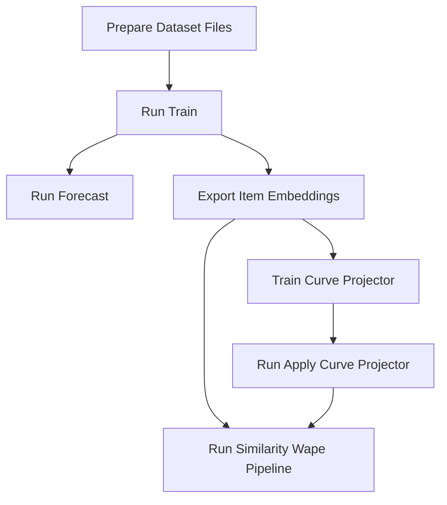

# GTM-Transformer (VISUELLE2.0)

本仓库用于销量预测，核心流程是：
`训练模型 -> 推理/导出 embedding -> 相似度检索评估(WAPE) ->  projector 增强`。

原论文：  
[Well Googled is Half Done: Multimodal Forecasting of New Fashion Product Sales with Image-based Google Trends](https://arxiv.org/abs/2109.09824)

## 1. Train & Inference Routes



## 2. File Descriptions

- `train.py`：训练 `GTM/FCN`。
- `forecast.py`：推理并输出指标与 `results/*.pth`。
- `forecast_csv.py`：推理并导出可读预测 CSV。
- `export_item_embeddings.py`：导出 train/test/all 的 embedding 与曲线表。
- `similarity_wape_pipeline.py`：基于 embedding 的检索评估（MAE/WAPE/曲线指标）。
- `train_curve_projector.py`：训练对比学习 projector
- `apply_curve_projector.py`：将 projector 应用于 train/test embedding
- `run_similarity_wape_with_projected.py`：`similarity_wape_pipeline.py` 检测最终 inference 结果 wape

## 3. Data Input (Visuelle2.0)

`<DATA_DIR>/` 下至少包含：

- `train.csv`, `test.csv`
- `gtrends.csv`
- `images/`
- `category_labels.pt`, `color_labels.pt`, `fabric_labels.pt`
- `normalization_scale.npy`（用于反归一化）

## 4. Env Settings

```bash
# python=3.10.8 pip=22.0.2 
python -m venv .venv
# Windows
.venv\Scripts\activate

pip install -r requirements.txt
```

## 5. Quick Start

### 5.1 Train

```bash
python train.py \
  --data_folder "<DATA_DIR>/" \
  --gpu_num 0 \
  --model_type GTM \
  --train_frac 1.0 \
  --lazy_loader 1 \
  --use_hist_sales 0 \
  --wandb_entity "<ENTITY>" \
  --wandb_proj "GTM" \
  --wandb_run "Run1"
```

### 5.2 forecast

```bash
python forecast.py \
  --data_folder "<DATA_DIR>/" \
  --ckpt_path "<CKPT_PATH>" \
  --gpu_num 0 \
  --model_type GTM \
  --output_dim 12 \
  --lazy_loader 1 \
  --use_hist_sales 0 \
  --wandb_run "Run1"
```

### 5.3 export forecast results

```bash
python forecast_csv.py \
  --data_folder "<DATA_DIR>/" \
  --ckpt_path "<CKPT_PATH>" \
  --gpu_num 0 \
  --model_type GTM \
  --output_dim 12 \
  --output_csv "results/forecast.csv" \
  --lazy_loader 1 \
  --use_hist_sales 0 \
  --wide_sales_weeks
```

Optional: use the denormalization file（`normalization_scale.npy`）：

- set the global max sales：`--rescale_max <GLOBAL_MAX>`
- 从 `train.csv` 前 12 周自动计算：`--scale_from_train_max --train_csv train.csv --num_week_cols 12`

### 5.4 export item embeddings

```bash
python export_item_embeddings.py \
  --checkpoint "<CKPT_PATH>" \
  --data_folder "<DATA_DIR>/" \
  --output_dir "outputs" \
  --split all \
  --gpu_num 0 \
  --device cuda \
  --lazy_loader 1 \
  --use_hist_sales 0 \
  --output_format compact \
  --compact_storage parquet \
  --train_frac 1.0 \
  --seed 21
```

### 5.5 similarity & wape 

```bash
python similarity_wape_pipeline.py \
  --train_csv "outputs/train_item_embeddings.parquet" \
  --test_csv "outputs/test_item_embeddings.parquet" \
  --top_k 20 \
  --start_week 2 \
  --compare_topk 1,5,20 \
  --save_prefix "results/sim_wape/run1"
```

## 6. Projector

### 6.1 train projector

```bash
python train_curve_projector.py \
  --train_embeddings_npy "outputs/train_item_embeddings.npy" \
  --train_curves_csv "outputs/train_item_embeddings.parquet" \
  --output_dir "results/curve_projector" \
  --epochs 20 \
  --pca_components 0 \
  --device cuda \
  --train_frac 1.0 \
  --train_sample_seed 21
```

### 6.2 apply projector

```bash
python apply_curve_projector.py \
  --projector_dir "results/curve_projector" \
  --train_embeddings_npy "outputs/train_item_embeddings.npy" \
  --test_embeddings_npy "outputs/test_item_embeddings.npy" \
  --output_dir "results/curve_projector/projected" \
  --device cuda
```

### 6.3 reevaluate using projected embeddings

```bash
python similarity_wape_pipeline.py \
  --train_csv "outputs/train_item_embeddings.parquet" \
  --test_csv "outputs/test_item_embeddings.parquet" \
  --train_emb_npy "results/curve_projector/projected/train_item_embeddings_projected.npy" \
  --test_emb_npy "results/curve_projector/projected/test_item_embeddings_projected.npy" \
  --top_k 20 \
  --start_week 2 \
  --save_prefix "results/sim_wape/projected"
```


## 7. FAQs

- 显存不足：优先启用 `--lazy_loader 1`，并减小 batch。
- 输出列名里有 `*_restored` 但数值看起来仍很小：这通常是归一化空间或反归一化配置不一致导致。

## 8. Citation

```text
@misc{skenderi2021googled,
      title={Well Googled is Half Done: Multimodal Forecasting of New Fashion Product Sales with Image-based Google Trends},
      author={Geri Skenderi and Christian Joppi and Matteo Denitto and Marco Cristani},
      year={2021},
      eprint={2109.09824},
}
```