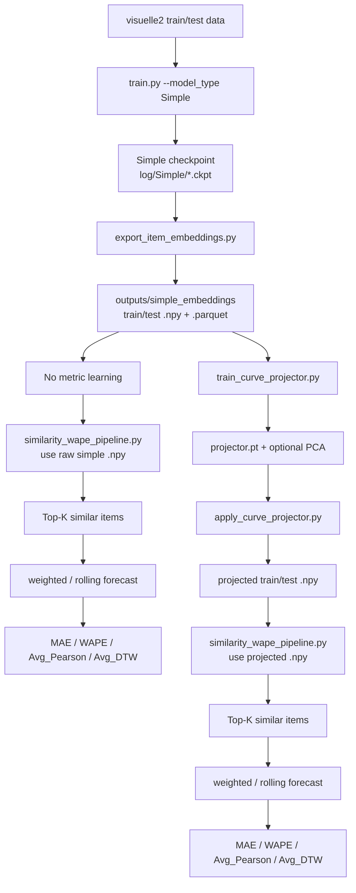

# 人工特征融合
## 类函数
- Product Similarity
- Group Similarity
## 检验函数
- test_curves_df
- test_codes_df

# GTM-Transformer
Official Pytorch Implementation of [**Well Googled is Half Done: Multimodal Forecasting of New Fashion Product Sales with Image-based Google Trends**](https://arxiv.org/abs/2109.09824) paper

[](https://paperswithcode.com/sota/new-product-sales-forecasting-on-visuelle?p=well-googled-is-half-done-multimodal)

## env settings
```bash
export HF_ENDPOINT=https://hf-mirror.com
# 关闭wandb
# 设置pip为镜像源
tmux attach -t my_training_session
```

## 使用了全部`train`的ckpt
```
/data/coding/tmp_GTM_transformer/log/GTM/GTM_Run1---epoch=104---02-04-2026-21-00-31.ckpt
```

## Installation

We suggest the use of VirtualEnv.

```bash

python3 -m venv gtm_venv
source gtm_venv/bin/activate
# gtm_venv\Scripts\activate.bat # If you're running on Windows

pip install numpy pandas matplotlib opencv-python permetrics Pillow scikit-image scikit-learn scipy tqdm transformers fairseq wandb

pip install torch torchvision

# For CUDA11.1 (NVIDIA 3K Serie GPUs)
# Check official pytorch installation guidelines for your system
pip install torch==1.9.0+cu111 torchvision==0.10.0+cu111 -f https://download.pytorch.org/whl/torch_stable.html

pip install pytorch-lightning

export INSTALL_DIR=$PWD

cd $INSTALL_DIR
git clone https://github.com/HumaticsLAB/GTM-Transformer.git
cd GTM-Transformer
mkdir ckpt
mkdir dataset
mkdir results

unset INSTALL_DIR
```

## Dataset

**VISUELLE** dataset is publicly available to download [here](https://forms.gle/cVGQAmxhHf7eRJ937). Please download and extract it inside the dataset folder.

## Training
To train the model of GTM-Transformer please use the following scripts. Please check the arguments inside the script before launch.

```bash
python train.py --data_folder dataset
```

```bash
python train.py --data_folder "visuelle2/" --gpu_num 0 --model_type GTM --train_frac 1
```

## Inference
To evaluate the model of GTM-Transformer please use the following script .Please check the arguments inside the script before launch.

```bash
python forecast.py --data_folder dataset --ckpt_path ckpt/model.pth

python forecast.py --data_folder "visuelle2/" --ckpt_path "log/MMTS/MMTS_Run1---epoch=134---19-05-2026-20-27-42.ckpt"

python forecast_csv.py --data_folder "visuelle2/" --ckpt_path "log/GTM/GTM_Run1---epoch=169---27-03-2026-11-28-07.ckpt" --output_dim 12 --gpu_num 0 --output_csv results/my_forecast.csv


python forecast_csv.py --data_folder "visuelle2/" --ckpt_path "log/GTM/GTM_Run1---epoch=44---31-03-2026-13-15-01.ckpt" --output_dim 12 --gpu_num 0 --output_csv results/my_forecast.csv

python forecast_csv.py --data_folder "visuelle2/" --ckpt_path "log/GTM/GTM_Run1---epoch=104---02-04-2026-21-00-31.ckpt" --output_dim 12 --gpu_num 0 --output_csv results/my_forecast.csv

cd /data/coding/tmp_GTM_transformer
python similarity_wape_pipeline.py \
  --train_csv outputs/train_item_embeddings.csv \
  --test_csv outputs/test_item_embeddings.csv \
  --top_k 20 \
  --start_week 2 \
  --save_prefix results/sim_wape \
  --compare_topk 1,5,20
```

## Export Item Embedddings
export：test
```bash
python export_item_embeddings.py \
  --model_type GTM \
  --checkpoint log/GTM/GTM_Run1---epoch=104---02-04-2026-21-00-31.ckpt \
  --data_folder visuelle2/ \
  --split all \
  --output_dir outputs/GTM_embeddings \
  --output_dim 10
```

```bash
python train_curve_projector.py  --train_embeddings_npy outputs/GTM_embeddings/train_item_embeddings.npy  --train_curves_csv outputs/GTM_embeddings/train_item_embeddings.parquet  --output_dir results/GTM_PCA  --pca_components 32  --epochs 50 --topk_loss_coef 1000 --lambda_metric 0.5


python apply_curve_projector.py  --projector_dir results/GTM_PCA  --train_embeddings_npy outputs/GTM_embeddings/train_item_embeddings.npy  --test_embeddings_npy outputs/GTM_embeddings/test_item_embeddings.npy  --output_dir results/GTM_PCA/projected  --device cuda

# 对比学习+PCA
python similarity_wape_pipeline.py --train_csv outputs/GTM_embeddings/train_item_embeddings.parquet --test_csv outputs/GTM_embeddings/test_item_embeddings.parquet   --train_emb_npy results/GTM_PCA/projected/train_item_embeddings_projected.npy   --test_emb_npy results/GTM_PCA/projected/test_item_embeddings_projected.npy --save_prefix results/GTM_PCA/WAPE_results
```

export: train
```bash
python export_item_embeddings.py --checkpoint "path/to/your.ckpt" --data_folder "dataset/" --split train --output_dir "outputs/"
```

export: all
```bash
python export_item_embeddings.py --checkpoint "path/to/your.ckpt" --data_folder "dataset/" --split all --output_dir "outputs/"
```

```bash
# example of ckpt path and export item embeddings
tmp_GTM_transformer/log/GTM/GTM_Run1---epoch=29---25-03-2026-13-17-24.ckpt

python export_item_embeddings.py --checkpoint "log/GTM/GTM_Run1---epoch=29---25-03-2026-13-17-24.ckpt" --data_folder "visuelle2/" --split all --output_dir "outputs/"

python export_item_embeddings.py --checkpoint "log/GTM/GTM_Run1---epoch=104---02-04-2026-21-00-31.ckpt" --data_folder "visuelle2/" --split all --output_dir "outputs/"
```

## Citation
```
@misc{skenderi2021googled,
      title={Well Googled is Half Done: Multimodal Forecasting of New Fashion Product Sales with Image-based Google Trends}, 
      author={Geri Skenderi and Christian Joppi and Matteo Denitto and Marco Cristani},
      year={2021},
      eprint={2109.09824},
}
```

## 对比学习 metric learning projector
```bash
# 1) 在 GTM-Transformer 目录，用已导出的 train 向量训练（曲线与 npy 行对齐，如 train.csv 或带 sales_wk_* 的导出表）
python train_curve_projector.py --train_embeddings_npy outputs/train_item_embeddings.npy --train_curves_csv outputs/train_item_embeddings.parquet --output_dir results/curve_projector --epochs 20 --pca_components 0 

# 2) 生成投影后的 train/test npy
python apply_curve_projector.py --projector_dir results/curve_projector --train_embeddings_npy outputs/train_item_embeddings.npy  --test_embeddings_npy outputs/test_item_embeddings.npy --output_dir results/curve_projector/projected

# 3) WAPE（ GTM-Transformer 下用 run_similarity_wape_with_projected.py） 这个是使用了对比学习的metric 有对比学习，没有PCA
python similarity_wape_pipeline.py --train_csv outputs/train_item_embeddings.parquet --test_csv outputs/test_item_embeddings.parquet   --train_emb_npy results/curve_projector/projected/train_item_embeddings_projected.npy   --test_emb_npy results/curve_projector/projected/test_item_embeddings_projected.npy --save_prefix results/curve_projector/WAPE_results


# 不使用对比学习trick跑的 WAPE 没有对比学习/PCA
python similarity_wape_pipeline.py --train_csv outputs/train_item_embeddings.parquet --test_csv outputs/test_item_embeddings.parquet   --train_emb_npy outputs/train_item_embeddings.npy   --test_emb_npy outputs/test_item_embeddings.npy --save_prefix results/curve_nonprojected/WAPE_results
```


## 带有PCA的projector

```bash
python train_curve_projector.py \
  --train_embeddings_npy outputs/train_item_embeddings.npy \
  --train_curves_csv outputs/train_item_embeddings.parquet \
  --output_dir results/curve_projector_pca \
  --pca_components 32 \
  --epochs 20


python apply_curve_projector.py \
  --projector_dir results/curve_projector_pca \
  --train_embeddings_npy outputs/train_item_embeddings.npy \
  --test_embeddings_npy outputs/test_item_embeddings.npy \
  --output_dir results/curve_projector_pca/projected \
  --device cuda

# 对比学习+PCA
python similarity_wape_pipeline.py --train_csv outputs/train_item_embeddings.parquet --test_csv outputs/test_item_embeddings.parquet   --train_emb_npy results/curve_projector_pca/projected/train_item_embeddings_projected.npy   --test_emb_npy results/curve_projector_pca/projected/test_item_embeddings_projected.npy --save_prefix results/curve_projector_pca/WAPE_results

```

## sim wape pipeline

这里才能看Avg_pairwise_corr等四个参数
'Avg_pairwise_corr': 
'Avg_cv_total': 
'Avg_cv_week'
'Avg_sim': 


## 0销量数据 zero-shot cold start
```bash
# 使用outputs_44_frac4下的数据(仅为远端linux示例)，实际复现时请自己训练不带有2 weeks 销量作为embedding的数据

python similarity_wape_pipeline.py  --train_csv outputs_44_frac4/train_item_embeddings.parquet  --test_csv outputs_44_frac4/test_item_embeddings.parquet  --top_k 20  --start_week 2  --save_prefix results/sim_wape  --compare_topk 1,5,20
```

## ablation study
1. 不使用Google trends数据（只是在导出emebddings时置为0，并不是前面训练GTM不用，只是为了工程方便）

```bash
python export_item_embeddings.py --checkpoint "log/GTM/GTM_Run1---epoch=104---02-04-2026-21-00-31.ckpt"   --data_folder "visuelle2/"   --output_dir outputs_ablate_trends --split all --ablate_trends 1
```


消融projector
```bash
python train_curve_projector.py --train_embeddings_npy outputs_ablate_trends/train_item_embeddings.npy  --train_curves_csv outputs_ablate_trends/train_item_embeddings.parquet  --output_dir results/curve_projector_ablate_trends --epochs 20

python apply_curve_projector.py --projector_dir results/curve_projector_ablate_trends  --train_embeddings_npy outputs_ablate_trends/train_item_embeddings.npy  --test_embeddings_npy outputs_ablate_trends/test_item_embeddings.npy  --output_dir results/curve_projector_ablate_trends/projected

最后 similarity_wape_pipeline

python similarity_wape_pipeline.py --train_csv outputs_ablate_trends/train_item_embeddings.parquet --test_csv outputs_ablate_trends/test_item_embeddings.parquet   --train_emb_npy results/curve_projector_ablate_trends/projected/train_item_embeddings_projected.npy   --test_emb_npy results/curve_projector_ablate_trends/projected/test_item_embeddings_projected.npy --save_prefix results/curve_projector_ablate_trends/WAPE_results
```

## ablation study 2: fabric + color + category + images
```bash
python export_item_embeddings.py --checkpoint "log/GTM/GTM_Run1---epoch=104---02-04-2026-21-00-31.ckpt"  --data_folder "visuelle2/" --output_dir outputs_ablation2  --split all  --ablation2_ccf_img 1

python train_curve_projector.py  --train_embeddings_npy outputs_ablation2/train_item_embeddings.npy   --train_curves_csv outputs_ablation2/train_item_embeddings.parquet  --output_dir results/curve_projector_ablation2 --epochs 20

python apply_curve_projector.py --projector_dir results/curve_projector_ablation2  --train_embeddings_npy outputs_ablation2/train_item_embeddings.npy --test_embeddings_npy outputs_ablation2/test_item_embeddings.npy --output_dir results/curve_projector_ablation2/projected

python similarity_wape_pipeline.py --train_csv outputs_ablation2/train_item_embeddings.parquet --test_csv outputs_ablation2/test_item_embeddings.parquet --train_emb_npy results/curve_projector_ablation2/projected/train_item_embeddings_projected.npy --test_emb_npy results/curve_projector_ablation2/projected/test_item_embeddings_projected.npy --save_prefix results/curve_projector_ablation2/eval
```

## forecast mode: 滚动预测
两周 -> 一周 滚动预测, 在2-10pipeline得到的WAPE:84.833%

```bash
python similarity_wape_pipeline.py  --train_csv outputs/train_item_embeddings.parquet  --test_csv outputs/test_item_embeddings.parquet  --train_emb_npy results/curve_projector_pca/projected/train_item_embeddings_projected.npy --test_emb_npy results/curve_projector_pca/projected/test_item_embeddings_projected.npy --top_k 20  --start_week 3  --forecast_mode rolling_2w1w --rolling_dyn_temp 1.0 --save_prefix results/curve_projector_pca/WAPE_results 


```

## curve projector 损失函数改动
为了让curve projector在学习曲线相似度的同时贴近，把损失函数改为
$ loss = MSE + \lambda * metric_loss $

新增 / 相关参数	默认	含义
--topk_loss_coef
0
关掉「与 similarity_wape 一致的 Top-K 加权曲线 MSE」；不设就和以前只训 Pearson metric 一样
--lambda_metric
1.0
Pearson–cosine MSE 权重
--top_k
20
仅在 topk_loss_coef > 0 时生效
--pool_size
512
同上
--topk_query_batch
32
同上
--curve_loss_start_idx
1
Top-K 分支里曲线 MSE 的起始周（0-based）
约束：topk_loss_coef 和 lambda_metric 不能同时为 0（否则会报错）。

其余：--train_embeddings_npy、--train_curves_csv、--output_dir、--epochs、--pca_components 等与原来一致。

## 改动后：带有PCA的projector
WAPE:83.326%
```bash

# 这里的topk_loss_coef 设置这么大是因为想要两个loss物理尺度上对齐
# coef为1时，两个loss尺度示例：epoch 1 mean loss: 0.173901  (metric: 0.346462, topk_wape_pipe: 0.000670) 

python train_curve_projector.py  --train_embeddings_npy outputs/train_item_embeddings.npy  --train_curves_csv outputs/train_item_embeddings.parquet  --output_dir results/curve_projector_pca  --pca_components 32  --epochs 50 --topk_loss_coef 1000 --lambda_metric 0.5


python apply_curve_projector.py  --projector_dir results/curve_projector_pca  --train_embeddings_npy outputs/train_item_embeddings.npy  --test_embeddings_npy outputs/test_item_embeddings.npy  --output_dir results/curve_projector_pca/projected  --device cuda

# 对比学习+PCA
python similarity_wape_pipeline.py --train_csv outputs/train_item_embeddings.parquet --test_csv outputs/test_item_embeddings.parquet   --train_emb_npy results/curve_projector_pca/projected/train_item_embeddings_projected.npy   --test_emb_npy results/curve_projector_pca/projected/test_item_embeddings_projected.npy --save_prefix results/curve_projector_pca/WAPE_results

```


## LGBM作为预测头的流程
```bash
/data/coding/gtm_venv/bin/python tmp_GTM_transformer/embeddings_lgbm_predict.py --train tmp_GTM_transformer/outputs/train_item_embeddings.parquet --test tmp_GTM_transformer/outputs/test_item_embeddings.parquet --train_nrows 96166 --test_nrows 10684  --forecast_mode rolling_2w1w --rolling_teacher_forcing
=== LGBM Hparam Analysis ===
n_estimators,learning_rate,mae,wape,best_iteration,samples
96,0.08,0.036,73.811,84,20
100,0.08,0.036,73.811,84,20
128,0.08,0.036,73.811,84,20
128,0.06,0.036,73.937,122,20
64,0.1,0.036,74.079,52,20
96,0.1,0.036,74.079,52,20
100,0.1,0.036,74.079,52,20
128,0.1,0.036,74.079,52,20
50,0.1,0.036,74.208,49,20
128,0.04,0.036,74.227,124,20
96,0.06,0.036,74.481,88,20
100,0.06,0.036,74.481,88,20
96,0.04,0.036,74.559,95,20
100,0.04,0.036,74.559,95,20
64,0.08,0.036,74.564,64,20
50,0.08,0.036,74.805,50,20
64,0.06,0.036,74.866,64,20
64,0.04,0.037,75.117,64,20
50,0.06,0.037,75.138,49,20
50,0.04,0.037,75.475,50,20

```

```bash
/data/coding/gtm_venv/bin/python tmp_GTM_transformer/embeddings_lgbm_predict.py \
  --train tmp_GTM_transformer/outputs/train_item_embeddings.parquet \
  --test tmp_GTM_transformer/outputs/test_item_embeddings.parquet \
  --train_nrows 96166 \
  --test_nrows 10684 \
  --analyze_hparams \
  --n_estimators_grid 256 \
  --learning_rate_grid 0.02,0.04,0.06 \
  --num_leaves_grid 31 \
  --min_child_samples_grid 10 \
  --subsample_grid 0.8 \
  --colsample_bytree_grid 0.8 \
  --reg_lambda_grid 1.0 \
  --analysis_output_csv tmp_GTM_transformer/results/emb_lgbm_hparam_analysis_stage1.csv \
  --forecast_mode rolling_2w1w \
  --rolling_teacher_forcing \
  --device_type cuda \
  --max_bin 63

python GTM/GTM-Transformer/embeddings_lgbm_predict.py `
  --analyze_hparams 
  --n_estimators_grid "50,64,96,100,128,500" 
  --learning_rate_grid "0.01,0.03,0.05,0.07,0.09,0.1" `
  --num_leaves_grid "31,63,127" `
  --min_child_samples_grid "1,3,5,10,30,60" `
  --subsample_grid "0.8,1.0" `
  --colsample_bytree_grid "0.8,1.0" `
  --reg_lambda_grid "0.1,1.0,5.0"
```

## MMTS pipeline

```bash
python train.py --model_type MMTS --forecast_mode direct_2_10 --train_frac 0.01 --epochs 150 --data_folder "visuelle2/"

python train.py --model_type MMTS --forecast_mode rolling_2_1 --train_frac 0.01 --epochs 150 --data_folder "visuelle2/"
# 预测和训练， 2-1 和 2-10 命令， 完整训练时 train_frac 参数设置为1，小样本测试可用0.01
python train.py \
  --data_folder visuelle2/ \
  --model_type MMTS \
  --forecast_mode direct_2_10 \
  --train_frac 1 \
  --epochs 150 \
  --batch_size 128 \
  --embedding_dim 32 \
  --hidden_dim 64 \
  --num_attn_heads 4 \
  --use_img 1 \
  --use_text 1 \
  --contrastive_loss_weight 0.1 \
  --contrastive_temperature 0.07 \
  --lazy_loader 1 \
  --gpu_num 0 \
  --seed 21 \
  --log_dir log

python train.py \
  --data_folder visuelle2/ \
  --model_type MMTS \
  --forecast_mode rolling_2_1 \
  --train_frac 1 \
  --epochs 150 \
  --batch_size 128 \
  --embedding_dim 32 \
  --hidden_dim 64 \
  --num_attn_heads 4 \
  --use_img 1 \
  --use_text 1 \
  --contrastive_loss_weight 0.1 \
  --contrastive_temperature 0.07 \
  --lazy_loader 1 \
  --gpu_num 0 \
  --seed 21 \
  --log_dir log

python forecast.py \
  --model_type MMTS \
  --forecast_mode direct_2_10 \
  --ckpt_path log/MMTS/MMTS_Run1---epoch=134---19-05-2026-20-27-42.ckpt \
  --data_folder dataset/visuelle2/ \
  --gpu_num 0 \
  --use_img 1 \
  --use_text 1 \
  --embedding_dim 32 \
  --hidden_dim 64 \
  --num_attn_heads 4

# export MMTS embeddings
python export_item_embeddings.py \
  --model_type MMTS \
  --checkpoint log/MMTS/MMTS_Run1---epoch=134---19-05-2026-20-27-42.ckpt \
  --data_folder visuelle2/ \
  --output_dir outputs/mmts_embeddings \
  --split all \
  --train_frac 1.0

# predict using lgbm
python embeddings_lgbm_predict.py \
  --train outputs/mmts_embeddings/train_item_embeddings.parquet \
  --test outputs/mmts_embeddings/test_item_embeddings.parquet \
  --output_csv results/mmts_emb_lgbm_predictions.csv \
  --start_week 2 \
  --forecast_mode rolling_2w1w \
  --n_estimators 256 \
  --learning_rate 0.04 \
  --eval_ref_stats \
  --ref_top_k 20

# 使用加权平均预测和PCA,对比学习
# 1) 在 GTM-Transformer 目录，用已导出的 train 向量训练（曲线与 npy 行对齐，如 train.csv 或带 sales_wk_* 的导出表）
python train_curve_projector.py --train_embeddings_npy outputs/mmts_embeddings/train_item_embeddings.npy --train_curves_csv outputs/mmts_embeddings/train_item_embeddings.parquet --output_dir results/curve_projector_mmts --epochs 20 --pca_components 0 

# 2) 生成投影后的 train/test npy
python apply_curve_projector.py --projector_dir results/curve_projector_mmts --train_embeddings_npy outputs/mmts_embeddings/train_item_embeddings.npy  --test_embeddings_npy outputs/mmts_embeddings/test_item_embeddings.npy --output_dir results/curve_projector_mmts/projected

# 3) WAPE（ GTM-Transformer 下用 run_similarity_wape_with_projected.py） 这个是使用了对比学习的metric 有对比学习，没有PCA
python similarity_wape_pipeline.py \
  --train_csv outputs/mmts_embeddings/train_item_embeddings.parquet \
  --test_csv outputs/mmts_embeddings/test_item_embeddings.parquet \
  --train_emb_npy results/curve_projector_mmts/projected/train_item_embeddings_projected.npy \
  --test_emb_npy results/curve_projector_mmts/projected/test_item_embeddings_projected.npy \
  --save_prefix results/curve_projector_mmts/WAPE_results \
  --hit_ratio 0.1

# 2w1w
python similarity_wape_pipeline.py \
  --train_csv outputs/mmts_embeddings/train_item_embeddings.parquet \
  --test_csv outputs/mmts_embeddings/test_item_embeddings.parquet \
  --train_emb_npy results/curve_projector_mmts/projected/train_item_embeddings_projected.npy \
  --test_emb_npy results/curve_projector_mmts/projected/test_item_embeddings_projected.npy \
  --forecast_mode rolling_2w1w \
  --top_k 20 \
  --start_week 2 \
  --hit_ratio 0.1 \
  --save_prefix results/curve_projector_mmts/WAPE_results_2w1w

```

## StaticQKVGTM pipeline

`StaticQKVGTM` is a GTM-style experimental model. It first builds `static_feature_fusion` from image, text, temporal features, and optional 2-week sales. Unlike GTM, its horizon-level `Q/K/V` tokens are all generated from that static fusion vector, so Google Trends is not used as decoder key/value memory. Training also adds a CLIP-style InfoNCE term to align fused semantics with image/text semantics.

```bash
python train.py \
  --data_folder visuelle2/ \
  --model_type StaticQKVGTM \
  --train_frac 1 \
  --epochs 150 \
  --batch_size 128 \
  --embedding_dim 32 \
  --hidden_dim 64 \
  --output_dim 10 \
  --num_attn_heads 4 \
  --num_hidden_layers 1 \
  --use_img 1 \
  --use_text 1 \
  --use_hist_sales 1 \
  --contrastive_loss_weight 0.1 \
  --contrastive_temperature 0.07 \
  --lazy_loader 1 \
  --gpu_num 0 \
  --wandb_run StaticQKV_Run1

# 想要在这里关闭StaticQKVGTM 的CLIP 对比学习，设置 contrastive_loss_weight = 0即可
```

```bash
# 关闭了CLIP的StaticQKVGTM
python train.py \
  --data_folder visuelle2/ \
  --model_type StaticQKVGTM \
  --train_frac 1 \
  --epochs 150 \
  --batch_size 128 \
  --embedding_dim 32 \
  --hidden_dim 64 \
  --output_dim 10 \
  --num_attn_heads 4 \
  --num_hidden_layers 1 \
  --use_img 1 \
  --use_text 1 \
  --use_hist_sales 1 \
  --contrastive_loss_weight 0 \
  --contrastive_temperature 0 \
  --lazy_loader 1 \
  --gpu_num 0 \
  --log_dir 'log/noCLIP'
```

Export embeddings from a trained `StaticQKVGTM` checkpoint:

```bash
python export_item_embeddings.py \
  --model_type StaticQKVGTM \
  --checkpoint log/StaticQKVGTM/StaticQKVGTM_Run1---epoch=69---01-06-2026-00-52-35.ckpt \
  --data_folder visuelle2/ \
  --split all \
  --output_dir outputs/static_qkv_embeddings \
  --use_hist_sales 1 \
  --output_dim 10
```

## Simple Network

Simple 模型是一个轻量多模态 MLP 表征模型。它读取 category / color / fabric 文本属性、image、temporal features、recent_sales_2w，并经过各模态 projection 后拼接：

```text
image/text/temporal/recent_sales_2w -> projection -> concat -> fusion_layer -> h -> forecast_head
```

后续相似品检索使用的是 `return_embedding=True` 导出的隐藏层表示 `h`，不是 `forecast_head` 的直接预测值。

### Simple 全流程图



### 1. 训练 Simple 模型

完整训练使用 `train_frac 1`。小样本调试时可以把 `--train_frac` 改成 `0.01`。

```bash
python train.py \
  --data_folder visuelle2/ \
  --model_type Simple \
  --embedding_dim 32 \
  --hidden_dim 64 \
  --output_dim 12 \
  --batch_size 128 \
  --epochs 200 \
  --gpu_num 0 \
  --train_frac 1 \
  --log_dir log
```

训练结束后会在终端打印 best checkpoint 路径，通常类似：

```text
log/Simple/Simple_Run1---epoch=24---01-06-2026-23-27-54.ckpt
```

后续导出 embedding 时要使用这个 checkpoint。

### 2. 导出 Simple embedding

用训练好的 Simple checkpoint 导出 train/test/all 的 embedding。推荐 `--split all`，脚本会按 train 在前、test 在后的顺序导出，同时生成拆分后的 `train_item_embeddings.*` 和 `test_item_embeddings.*`。

```bash
python export_item_embeddings.py \
  --model_type Simple \
  --checkpoint log/Simple/Simple_Run1---epoch=24---01-06-2026-23-27-54.ckpt \
  --data_folder visuelle2/ \
  --split all \
  --output_dir outputs/simple_embeddings \
  --output_dim 12 \
  --device cuda
```

关键输出：

```text
outputs/simple_embeddings/train_item_embeddings.npy
outputs/simple_embeddings/test_item_embeddings.npy
outputs/simple_embeddings/train_item_embeddings.parquet
outputs/simple_embeddings/test_item_embeddings.parquet
```

其中：

- `.npy`：真正用于相似度检索的 embedding 矩阵，行序必须和对应 parquet 一致。
- `.parquet`：metadata、curve、release_date 等信息，用于 WAPE 和时间约束。

### 3. 不使用 Metric Learning 的预测

这是最直接的 Simple embedding 相似品预测流程：用原始 Simple hidden embedding 做 Top-K 检索。

```bash
python similarity_wape_pipeline.py \
  --train_csv outputs/simple_embeddings/train_item_embeddings.parquet \
  --test_csv outputs/simple_embeddings/test_item_embeddings.parquet \
  --train_emb_npy outputs/simple_embeddings/train_item_embeddings.npy \
  --test_emb_npy outputs/simple_embeddings/test_item_embeddings.npy \
  --top_k 20 \
  --start_week 2 \
  --min_ref_history_weeks 12 \
  --save_prefix results/Simple/NO_METRIC/WAPE_results
```

如果要使用 2 周到 1 周滚动预测：

```bash
python similarity_wape_pipeline.py \
  --train_csv outputs/simple_embeddings/train_item_embeddings.parquet \
  --test_csv outputs/simple_embeddings/test_item_embeddings.parquet \
  --train_emb_npy outputs/simple_embeddings/train_item_embeddings.npy \
  --test_emb_npy outputs/simple_embeddings/test_item_embeddings.npy \
  --forecast_mode rolling_2w1w \
  --top_k 20 \
  --start_week 2 \
  --min_ref_history_weeks 12 \
  --hit_ratio 0.1 \
  --save_prefix results/Simple/NO_METRIC/WAPE_results_2w1w
```

### 4. 使用 Metric Learning / PCA 的预测

这一步先用 train embedding 和 train curve 学一个 projector，让 embedding cosine similarity 更贴近曲线相似度。`--pca_components 32` 表示先 PCA 到 32 维再训练 projector；如果要关闭 PCA，设为 `0`。

```bash
python train_curve_projector.py \
  --train_embeddings_npy outputs/simple_embeddings/train_item_embeddings.npy \
  --train_curves_csv outputs/simple_embeddings/train_item_embeddings.parquet \
  --output_dir results/Simple_PCA \
  --pca_components 32 \
  --epochs 50 \
  --topk_loss_coef 1000 \
  --lambda_metric 0.5
```

把训练好的 projector 应用到 train/test embedding：

```bash
python apply_curve_projector.py \
  --projector_dir results/Simple_PCA \
  --train_embeddings_npy outputs/simple_embeddings/train_item_embeddings.npy \
  --test_embeddings_npy outputs/simple_embeddings/test_item_embeddings.npy \
  --output_dir results/Simple_PCA/projected \
  --device cuda
```

关键输出：

```text
results/Simple_PCA/projected/train_item_embeddings_projected.npy
results/Simple_PCA/projected/test_item_embeddings_projected.npy
```

然后用 projected embedding 做相似品预测：

```bash
python similarity_wape_pipeline.py \
  --train_csv outputs/simple_embeddings/train_item_embeddings.parquet \
  --test_csv outputs/simple_embeddings/test_item_embeddings.parquet \
  --train_emb_npy results/Simple_PCA/projected/train_item_embeddings_projected.npy \
  --test_emb_npy results/Simple_PCA/projected/test_item_embeddings_projected.npy \
  --top_k 20 \
  --start_week 2 \
  --min_ref_history_weeks 12 \
  --hit_ratio 0.1 \
  --save_prefix results/Simple_PCA/WAPE_results
```

滚动预测版本：

```bash
python similarity_wape_pipeline.py \
  --train_csv outputs/simple_embeddings/train_item_embeddings.parquet \
  --test_csv outputs/simple_embeddings/test_item_embeddings.parquet \
  --train_emb_npy results/Simple_PCA/projected/train_item_embeddings_projected.npy \
  --test_emb_npy results/Simple_PCA/projected/test_item_embeddings_projected.npy \
  --forecast_mode rolling_2w1w \
  --top_k 20 \
  --start_week 2 \
  --min_ref_history_weeks 12 \
  --hit_ratio 0.1 \
  --save_prefix results/Simple_PCA/WAPE_results_2w1w
```

### 5. Metric Learning without PCA

只关闭 PCA，其余流程相同：

```bash
python train_curve_projector.py \
  --train_embeddings_npy outputs/simple_embeddings/train_item_embeddings.npy \
  --train_curves_csv outputs/simple_embeddings/train_item_embeddings.parquet \
  --output_dir results/Simple_METRIC_ONLY \
  --pca_components 0 \
  --epochs 50 \
  --topk_loss_coef 1000 \
  --lambda_metric 0.5

python apply_curve_projector.py \
  --projector_dir results/Simple_METRIC_ONLY \
  --train_embeddings_npy outputs/simple_embeddings/train_item_embeddings.npy \
  --test_embeddings_npy outputs/simple_embeddings/test_item_embeddings.npy \
  --output_dir results/Simple_METRIC_ONLY/projected \
  --device cuda

python similarity_wape_pipeline.py \
  --train_csv outputs/simple_embeddings/train_item_embeddings.parquet \
  --test_csv outputs/simple_embeddings/test_item_embeddings.parquet \
  --train_emb_npy results/Simple_METRIC_ONLY/projected/train_item_embeddings_projected.npy \
  --test_emb_npy results/Simple_METRIC_ONLY/projected/test_item_embeddings_projected.npy \
  --top_k 20 \
  --start_week 2 \
  --min_ref_history_weeks 12 \
  --save_prefix results/Simple_METRIC_ONLY/WAPE_results
```

### 6. 未经过 MSE 训练的 Simple embedding

如果只想导出随机初始化的 Simple hidden representation，用 `--random_init 1`。这不会加载 checkpoint，适合做未训练 MLP 表征的 baseline。

```bash
python export_item_embeddings.py \
  --model_type Simple \
  --random_init 1 \
  --data_folder visuelle2/ \
  --output_dir outputs/simple_random_h \
  --split all \
  --device cuda

python similarity_wape_pipeline.py \
  --train_csv outputs/simple_random_h/train_item_embeddings.parquet \
  --test_csv outputs/simple_random_h/test_item_embeddings.parquet \
  --train_emb_npy outputs/simple_random_h/train_item_embeddings.npy \
  --test_emb_npy outputs/simple_random_h/test_item_embeddings.npy \
  --forecast_mode rolling_2w1w \
  --top_k 20 \
  --start_week 2 \
  --min_ref_history_weeks 12 \
  --save_prefix results/Simple_NO_MSE/WAPE_results_2w1w
```

注意：projected embedding 推荐直接通过 `--train_emb_npy` / `--test_emb_npy` 传给 `similarity_wape_pipeline.py`，不要只把 projected npy 转成 parquet 后直接替换输入，除非确认 parquet 中实际被读取的 `train_emb` / `test_emb` 列已经被覆盖。
